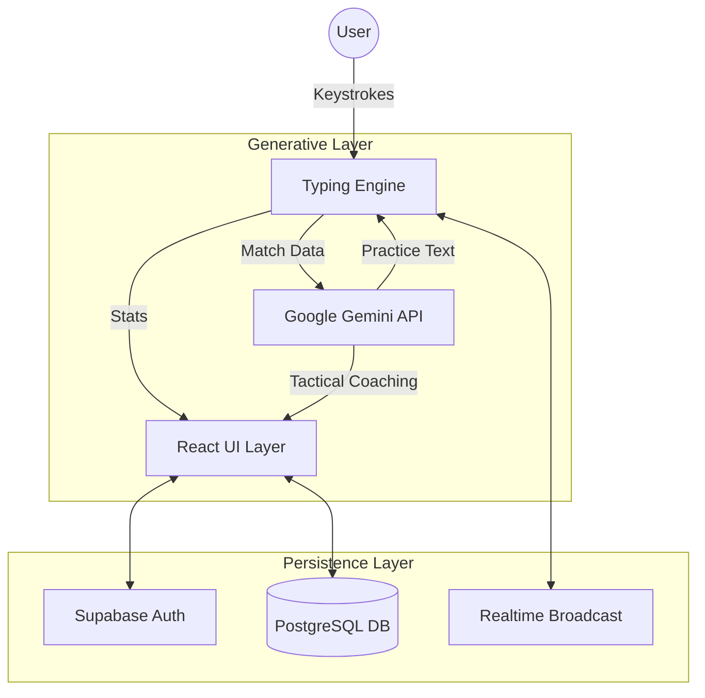

# ⌨️ TYPEARENA: The Intelligence-Driven Typing Ecosystem

[](https://reactjs.org/)
[](https://www.typescriptlang.org/)
[](https://vitejs.dev/)
[](https://supabase.io/)
[](https://deepmind.google/technologies/gemini/)
[](https://tailwindcss.com/)

> **TYPEARENA** is a production-grade, high-performance typing platform engineered for the modern web. It synthesizes real-time competitive mechanics with generative AI coaching to transform typing from a utility into a high-stakes competitive discipline.

---

## 🏗️ The Blueprint: Problem vs. Solution

| The Challenge | The TypeArena Solution |
| :--- | :--- |
| **Static Practice** | **Generative Challenges:** Gemini AI synthesizes unique technical and literary paragraphs on-the-fly based on difficulty. |
| **Isolated Training** | **Real-Time Synchronization:** Low-latency multiplayer lobbies powered by Supabase Realtime for live competitive racing. |
| **Opaque Feedback** | **AI Performance Telemetry:** Post-match analysis that identifies "confusion pairs" and provides tactical coaching via LLM diagnostics. |
| **Ephemeral Progress** | **Persistent Career Architecture:** Robust account sync, XP progression, and global ranking systems stored in a PostgreSQL backbone. |

---

## 🧠 Intelligence & Architecture

TypeArena operates on a **Tri-Tiered Intelligence Architecture**, decoupling the high-frequency typing engine from the generative AI services and the persistent data layer.

### System Flow Diagram



### Core Logic Blueprints

1.  **The Velocity Engine:** A custom-built React hook system that calculates WPM and Accuracy using the standard 5-character word formula, sampling data every 500ms for telemetry visualization.
2.  **The Real-Time Bridge:** Utilizes Supabase's broadcast channel to synchronize player progress across clients with <100ms latency, enabling the "Live Progress Bar" mechanic.
3.  **The Generative Pipeline:** Leverages `gemini-3-flash-preview` to generate contextually relevant practice text (Easy, Medium, Hard, or Coding modes) and provide post-game analysis.

---

## 🛠️ Technical Specification & Setup

### Prerequisites
- Node.js (v18+)
- Supabase Project (Auth & Database)
- Google Gemini API Key

### Environment Configuration
Create a `.env` file in the root directory:
```env
VITE_SUPABASE_URL=your_supabase_url
VITE_SUPABASE_ANON_KEY=your_supabase_anon_key
GEMINI_API_KEY=your_google_gemini_api_key
```

### Installation & Deployment
```bash
# Clone the repository
git clone https://github.com/rahulcvwebsitehosting/typearena.git

# Install dependencies
npm install

# Initialize development server
npm run dev

# Build for production
npm run build
```

---

## 🕹️ Interface Layout

| Component | Description |
| :--- | :--- |
| **Tactical Dashboard** | Central hub for career stats, XP progress, and global rank visualization. |
| **The Arena** | Minimalist, high-focus typing interface with real-time WPM/Accuracy telemetry. |
| **Multiplayer Lobby** | Live competitive environment with opponent progress tracking and global leaderboards. |
| **AI Diagnostics** | Post-match breakdown featuring "Confusion Heatmaps" and AI-generated tactical tips. |

---

## 🤝 Connect & Collaborate

Developed with precision by **Rahul Shyam**.

[](https://linkedin.com/in/rahulshyamcivil)
[](https://github.com/rahulcvwebsitehosting)

---

<p align="center">
  <i>Built for speed. Optimized for intelligence.</i><br>
  <b>© 2026 TypeArena Blueprint</b>
</p>
